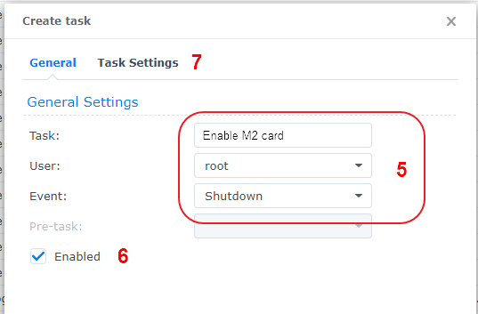
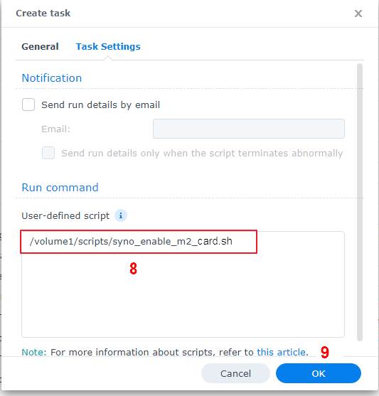

# Как запланировать сценарий в Synology

Чтобы запланировать запуск сценария на Synology при загрузке или завершении работы, выполните следующие действия:

**Примечание. ** Вы можете настроить задачу расписания и оставить ее отключенной, чтобы она запускалась только тогда, когда вы выбираете задачу в планировщике задач и нажимаете кнопку «Выполнить».

1. Перейдите в «Панель управления» > «Планировщик заданий» > нажмите «Создать» > и выберите «Запускаемая задача» .
2 Выберите Пользовательский сценарий .
3 Введите имя задачи.
4 Выберите root в качестве пользователя (сценарий должен запускаться от имени root).
5 Выберите Завершение работы в качестве события, запускающего задачу.
6 Оставьте галочку «Включить ».
7 Нажмите «Настройки задачи» .
8 При желании вы можете установить флажок «Отправлять сведения о запуске по электронной почте» и «Отправлять сведения о запуске только в случае аварийного завершения сценария», а затем ввести свой адрес электронной почты.
9. В поле Пользовательский скрипт введите путь к скрипту
    - например, если вы сохранили сценарий в общую папку на томе 1 под названием «scripts», введите: /volume1/scripts/syno_enable_m2_card.sh
11. Нажмите ОК, чтобы сохранить настройки.

